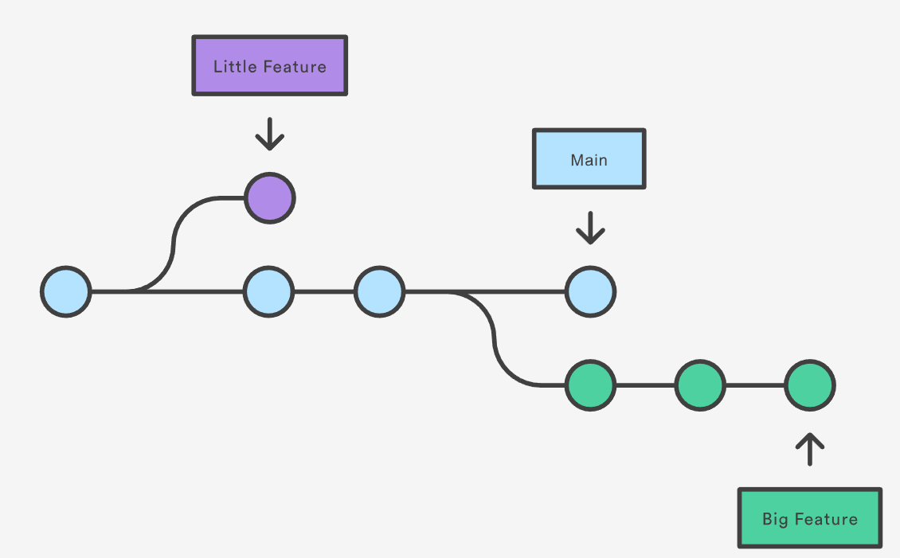

# Git

## About Version Control

What is “version control”, and why should you care? Version control is a system that records changes to a file or set of files over time so that you can recall specific versions later. a Version Control System (VCS) is a very wise thing to use. It allows you to revert selected files back to a previous state, revert the entire project back to a previous state, compare changes over time, see who last modified something that might be causing a problem, who introduced an issue and when, and more. Using a VCS also generally means that if you screw things up or lose files, you can easily recover. In addition, you get all this for very little overhead.

## What is Git

Git is a DevOps tool used for source code management. It is a free and open-source version control system used to handle small to very large projects efficiently. Git is used to tracking changes in the source code, enabling multiple developers to work together on non-linear development. Linus Torvalds created Git in 2005 for the development of the Linux kernel.

## Installing Git

If you want to install the basic Git tools on Linux via a binary installer, you can generally do so through the package management tool that comes with your distribution.

```bash
# If you’re on Fedora (or RHEL and CentOS), you can use dnf:
sudo dnf install git-all

# If you’re on a Debian-based distribution, such as Ubuntu, try apt:
sudo apt install git-all
```

To check git use git command

```bash
git

# Check git version
git --version
```

The first thing you should do when you install Git is to set your user name and email address. This is important because every Git commit uses this information, and it’s immutably baked into the commits you start creating:

```bash
git config --global user.name "Your NameHere"
git config --global user.email Your@email.com
```

## Start using Git

### Initializing a Repository in an Existing Directory

If you have a project directory that is currently not under version control and you want to start controlling it with Git, you first need to go to that project’s directory.

```bash
cd /home/user/my_project
```

If you want to start version-controlling existing files (as opposed to an empty directory), you should probably begin tracking those files and do an initial commit.

```bash
git add -A
git add --all
git add .
```

After adding file to staging by using command `git add` next user need to commit the change to local repo by using commit command.

```bash
git commit -m 'Initial project version'
```

### getting a repository from external repository

To get an repository from other source (i.e. github, gitlab, and others) user can use `git clone` command as shown below.

```bash
git clone https://github.com/kgfathur/devops-internship

# git will clone to target directory called mylibgit
git clone https://github.com/kgfathur/devops-internship mylibgit
```

## Working with Branch

In Git, branches are a part of your everyday development process. Git branches are effectively a pointer to a snapshot of your changes. When you want to add a new feature or fix a bug—no matter how big or how small—you spawn a new branch to encapsulate your changes.



to check branch on a repository you need to change directory and run branch command.

```bash
git branch

# output
* main
bug fix
feature-1
feature-2
```

to create new branch, use `branch` and then followed name of the branch.

```bash
git branch feature-3

# output
* main
bug fix
feature-1
feature-2
feature-3
```

To switch branch use `checkout` sub command

```bash
git checkout branch-name

# Example
git checkout feature-3
git branch

# output
main
bug fix
feature-1
feature-2
* feature-3
```

Pushing new branch to the remote registry use following command

```bash
git push -u remote_name branch_name
```

## Pushing to remote registry
