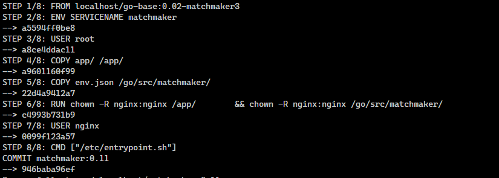

# Container

## What is Container

A container is a unit of software which packages up all the code, along with its dependencies, so that it can run quickly, independently, and reliably in any computing environment, including local machine, physical data centers, and public and private cloud infrastructures.

## Container vs VM

Containers and virtual machines (VM) differ in a number of ways, but the primary difference is that containers can virtualize an OS to enable it to run multiple containers on a single OS. Whereas, with a VM, the hardware is being virtualized so it can run multiple OS instances.


## The benefit of container

<p align="center">
    
</p>

### 1. Reusability

The same container can be reused without the need to set up a full OS.

### 2. Multiple environment deployment

In a traditional deployment using a single host, environment differences
could break the application. in container each dependencies and environment are isolated from each other.

### 3. Quick deployment

Containers deploy quickly because there is no need to install the entire operating
system, a restart and boot up take significant shorter time.

### 4. Low hardware footprint

Running an application in a VM is a way to create isolation from the running environment, but it requires a heavy layer of services to support the same low hardware footprint isolation provided by
containers.

## Images

A container image is an unchangeable, static file that includes executable code so it can run an isolated process on information technology (IT) infrastructure. The image is comprised of system libraries, system tools and other platforms settings a software program needs to run on a containerization platform such as Docker or CoreOS Rkt.  The image shares the OS kernel of its host machine.

Container images are stored in a registry that is either private or public on a repository, such as Docker Hub. The image creator pushes it to the registry, and a user pulls the image when they want to run it as a container. Features such as Docker Content Trust rely on digital signatures to help verify that images files downloaded from public repositories are original and unaltered. However, this added verification of authenticity does not prevent the creation or distribution of malware.



a layer, or image layer is a change on an image, or an intermediate image. Every command you specify (FROM, RUN, COPY, etc.) in your Dockerfile causes the previous image to change, thus creating a new layer. You can think of it as staging changes when you're using git.

## Volume

In order to be able to save (persist) data and also to share data between containers, Docker/podman came up with the concept of volumes. Quite simply, volumes are directories (or files) that are outside of the default Union File System and exist as normal directories and files on the host filesystem.

There are several ways to initialise volumes, with some subtle differences that are important to understand. The most direct way is declare a volume at run-time with the -v flag:

```bash
docker run -it --name vol-test -h CONTAINER -v /data debian /bin/bash
podman run -it --name vol-test -h CONTAINER -v /data debian /bin/bash
```

The exact same effect can be achieved by using a VOLUME instruction in a Dockerfile:

```dockerfile
FROM debian:wheezy
VOLUME /data
```

We can also create volumes using the docker volume create command:

```bash
docker volume create --name my-vol
```

Which we can then attach to a container at run-time e.g:

```bash
docker run -d -v my-vol:/data debian
```

## Network

Container networking enables containers to communicate with other containers or host and share their resources, data and applications. There are two main options when an application is run in a container:

* The application can be run in the host network namespace: This is a normal network, and if you run a program on port X, it will run on port X on the computer.

* The application can be run in its own network namespace: In a program running in its own network namespace, other programs on other computers must be able to establish a network connection with this program.

In cases where multiple containers are involved, the second option is implemented and each container should now have its own IP. A container network has now been created and it must be managed.

Flag value | Description
------- | -------
-p 8080:80 | Map TCP port 80 in the container to port 8080 on the Docker host.
-p 192.168.1.100:8080:80 | Map TCP port 80 in the container to port 8080 on the Docker host for connections to host IP 192.168.1.100.
-p 8080:80/udp | Map UDP port 80 in the container to port 8080 on the Docker host.
-p 8080:80/tcp -p 8080:80/udp | Map TCP port 80 in the container to TCP port 8080 on the Docker host, and map UDP port 80 in the container to UDP port 8080 on the Docker host.

example use of these flags

```bash
podman run -d --name devops-demo -p 80:8080 -p 443:4430 docker.io/library/nginx
```
