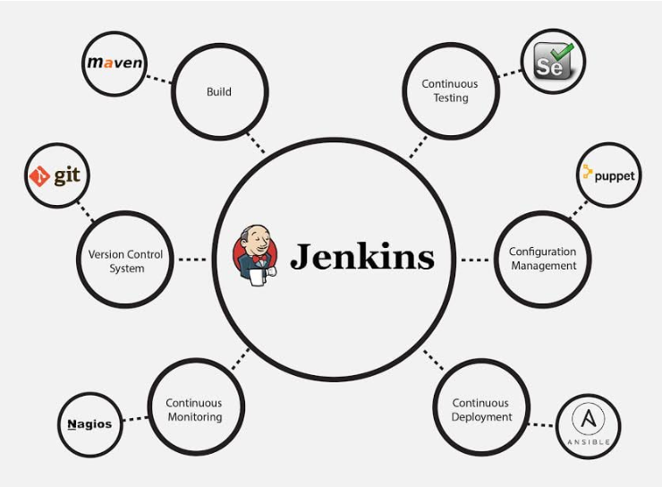

# Jenkins

## Jenkins is a self-contained, open source automation server which can be used to automate all sorts of tasks related to building, testing, and delivering or deploying software. 

    

## Jenkins can be installed through native system packages, Docker, or even run standalone by any machine with a Java Runtime Environment (JRE) installed.

&nbsp;

    

&nbsp;

# Advantages of Jenkins include:
- ### It is an open-source tool with great community support.
- ### It is easy to install.
- ### It has 1000+ plugins to ease your work. If a plugin does not exist, you can code it and share it with the community.
- ### It is free of cost.
- ### It is built with Java and hence, it is portable to all the major platforms.