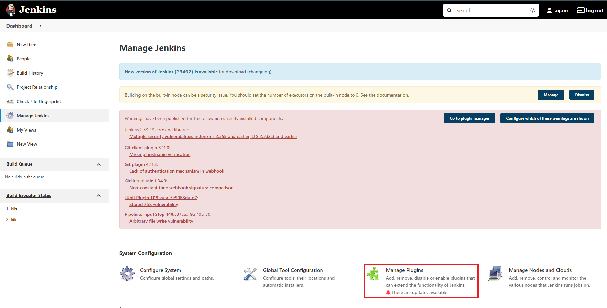
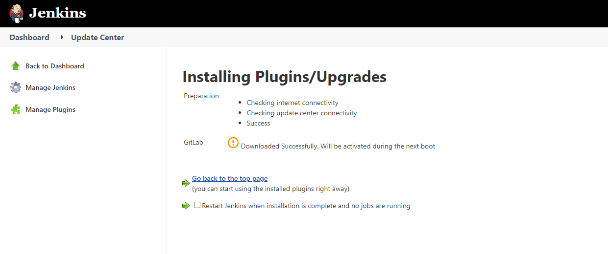

# Jenkins & Gitlab Integration

## 1. Download Gitlab Plugin for Jenkins (If not Already Exist)

### Go to Manage Jenkins and Choose Manage Plugins



### Choose Availabe Options, Search GitLab 

Checklist GitLab Plugin, then klik Download now and install after restart.
 


### Wait Until Installation Finish



## 2. Wait for Jenkins to Restart
### If You Are Impatient Restart Jenkins Service with Systemctl(at your own risk)
```bash
systemctl restart jenkins
```

## 3. Configure Connection to Gitlab
### Go to Manage Jenkins and Choose Configure System


### Find Gitlab
Checklist Enable Authentication for '/project' end-point so Jenkins can see project in Gitlab.


Click add, fill Connection Name (this is up to you) and Gitlab Host URL (your Gitlab URL)


For credentials click add and choose Jenkins, you will prompt with new windows


Choose Global credentials and change kind to GitLab API Token


Now open your GitLab, we need Personal Access Token from GitLab to give authorization to our Jenkins.

Choose which user in your GitLab that Jenkins can use for Authorization `IMPORTANT!!! JENKINS CAN ONLY SEE WHAT THIS USER SEE!!!`.

In this case, we use user Administrator so Jenkins can see all project in GitLab. 

Login your GitLab with that user, then choose Edit Profile


On the side bar, click Access Token


Fill Token Name(up to you), Expiration Date (leave empty if you want this token won't expired), checklist api and read_repository (you can give more access if you want).


You will get your new personal access token. `IMPORTANT!!! SAVE THIS TOKEN SOMEWHERE SAFE BECAUSE YOU CAN'T SEE IT AGAIN`


Copy the token, and go back to Jenkins. Paste the token to API Token, and fill the rest. Click Add.


In Credentials, choose the new credential that we just made.


Click Test Connection to test our config. If the config is right, there will be Success text at the right bottom.


## 4. Congratulation! Jenkins now connected with GitLab!
