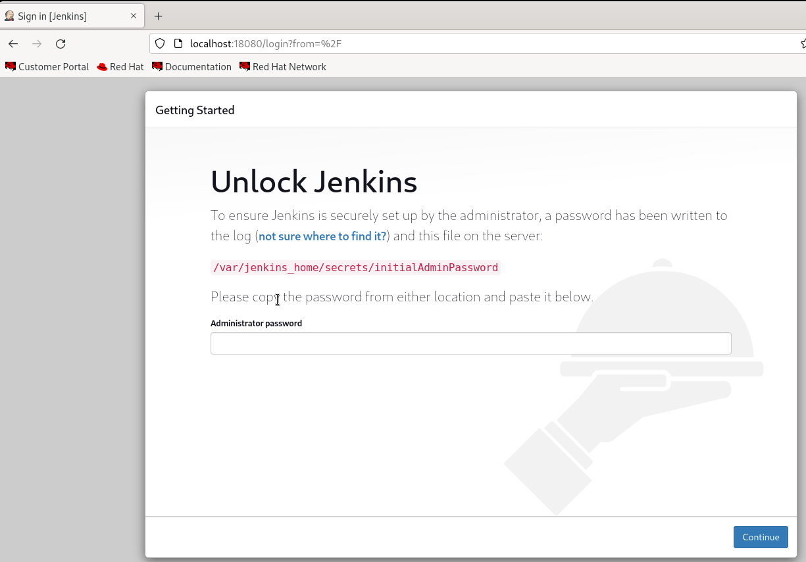
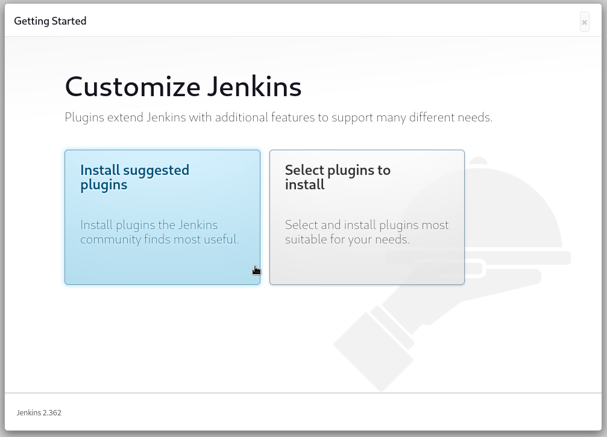
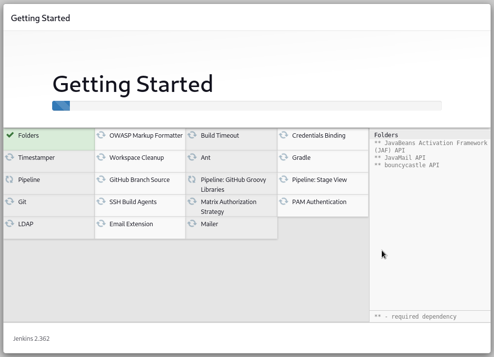
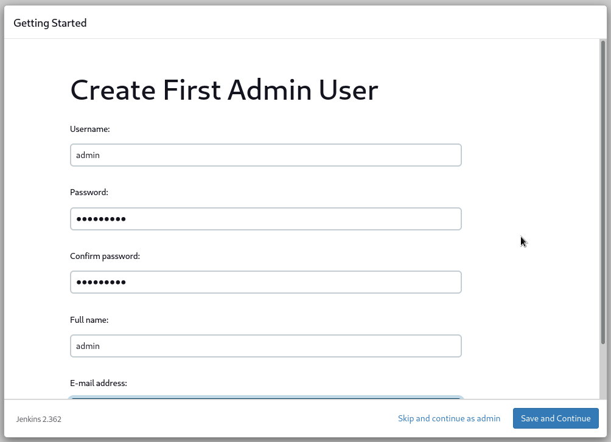
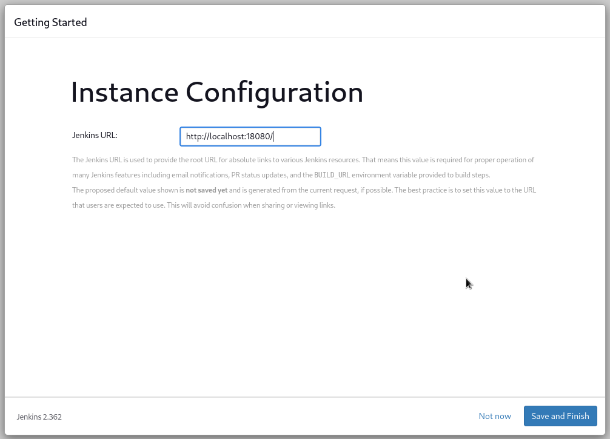
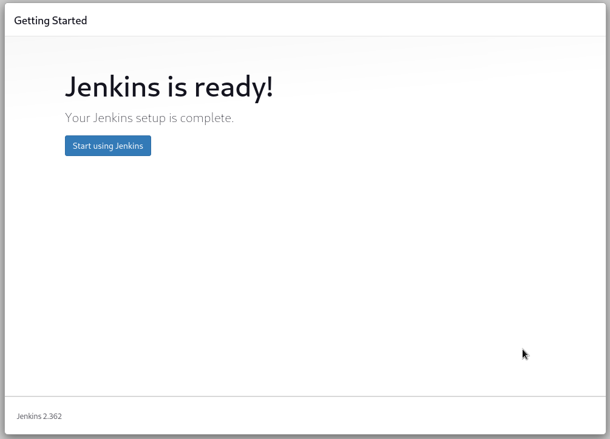
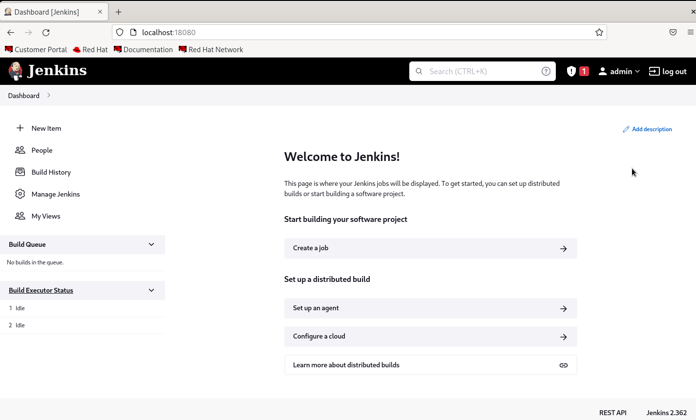

# Jenkins Installation on Container(Docker/Podman)

## 1. Pull Jenkins Image from docker.io repository using podman or docker command

```bash
# Podman
podman pull docker.io/jenkins/jenkins:latest

# Docker
docker pull docker.io/jenkins/jenkins:latest
```

## 2. Run container

Run the jenkins as a container and expose port and give the volume to jenkins use, command below is expose port 18080 in the host port to access the jenkins that listening to port 8080, then set a volume named jenkins-data to data inside /var/data/jenkins_home to be bind to.

```bash
# Podman
podman run -d -p 18080:8080 --name Jenkins -v jenkins-data:/var/data/jenkins_home jenkins/jenkins:latest

# Docker
docker run -d -p 18080:8080 --name Jenkins -v jenkins-data:/var/data/jenkins_home jenkins/jenkins:latest
```

## 3. Access Jenkins with localhost:(ex: localhost:18080)



Get admin password in /var/jenkins_home/secrets/initialAdminPassword or you can view your jenkins container log.

```bash
# Podman
podman exec -it Jenkins cat /var/jenkins_home/secrets/initialAdminPassword

# Docker
docker exec -it Jenkins cat /var/jenkins_home/secrets/initialAdminPassword

#Accessing via logs
podman logs <container-id/container-name>

docker logs <container-id/container-name>
```

c

## 4. Install recommended plugin





## 5. Create Admin User



## 6. Setting Jenkins Url(default=localhost:port)



## 7. Installation Complete!



