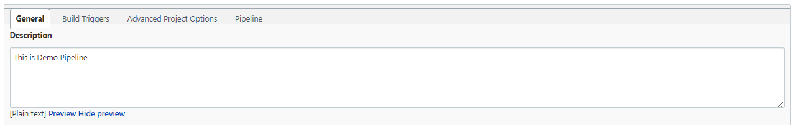
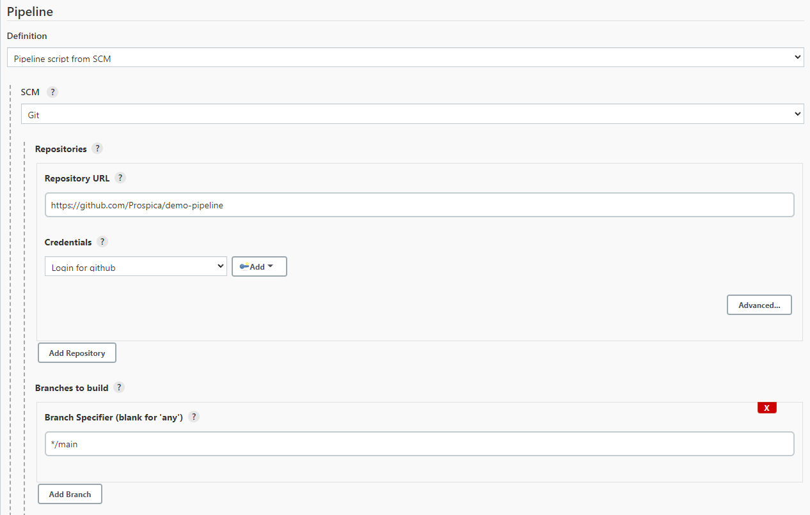
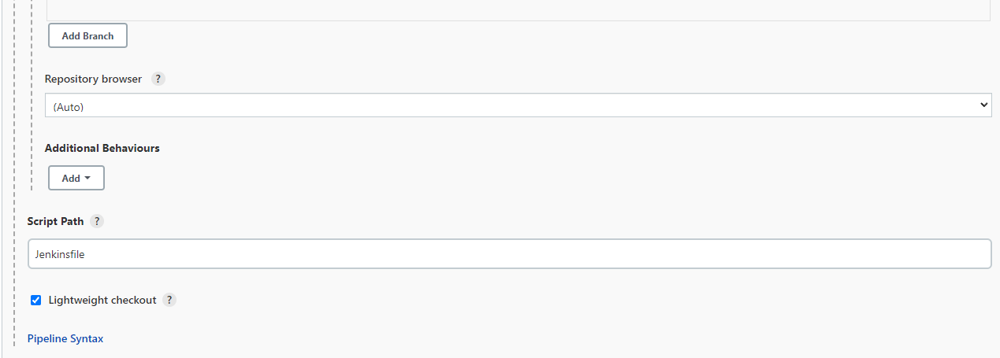
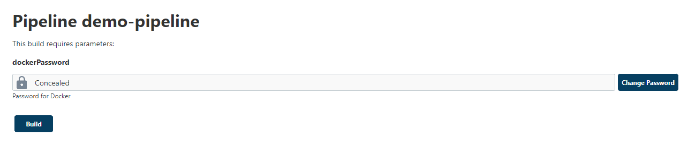
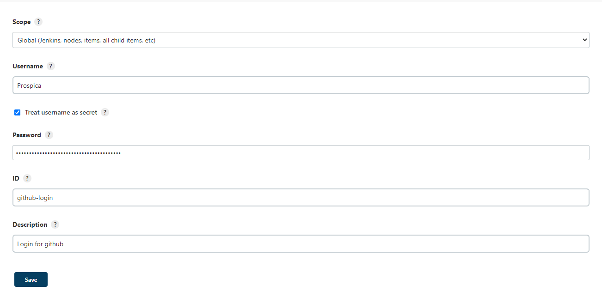

# Creating Jenkins Pipeline.
## 1. In Jenkins, Click New Item.


## 2. Fill the name of your pipeline, choose pipeline, than click OK.


## 3. Fill the description for your pipeline.



## 4. Create parameter for your docker account password.


Checklist `The project is paramaterized` and click `Add Parameter`. Choose `Password Parameter`. Fill the information needed.


## 5. Create pipeline script.

### In this guide, we will create pipeline to create image from our Dockerfile in SCM and push it to docker registry. Open your text editor(ex: VS Code), and start write your pipeline script.

```jenkinsfile
pipeline{
    agent {
		node {
			label 'java11'
		}
	}
    stages{
        stage("SCM Checkout"){
            steps{
                checkout([$class: 'GitSCM', branches: [[name: '*/main']], doGenerateSubmoduleConfigurations: false, extensions: [[$class: 'CleanBeforeCheckout', deleteUntrackedNestedRepositories: true]], submoduleCfg: [], userRemoteConfigs: [[credentialsId: 'gitlab', url: 'http://10.8.60.213/root/node-demo/']]])
            }
        }
    }
}
```
We define agent and node block with label `java11` so our pipeline will run on agent with label `java11`.

At the first steps, we want to do SCM Checkout or Git Pull from our SCM. The command will be like above for pull our SCM. Fill the information needed, in this case :

- branches : Master -> we want pull from master branch.
- credentialsId : gitlab -> this is our credential to login to SCM, how to config it will be explained at below.
- url : http://10.8.60.213/root/node-demo/ -> our project url in SCM

```jenkinsfile
pipeline{
    agent {
		node {
			label 'java11'
		}
	}
    stages{
        stage("SCM Checkout"){
            steps{
                checkout([$class: 'GitSCM', branches: [[name: '*/main']], doGenerateSubmoduleConfigurations: false, extensions: [[$class: 'CleanBeforeCheckout', deleteUntrackedNestedRepositories: true]], submoduleCfg: [], userRemoteConfigs: [[credentialsId: 'gitlab', url: 'http://10.8.60.213/root/node-demo/']]])
            }
        }
        stage("Create Image"){
            steps{
                sh '''
                docker build -t prospica/demo-pipeline:v1 .
                '''
            }
        }
    }
}
```
Add the next stage to create our image using docker command. Give the tag for our image.

```jenkinsfile
pipeline{
    agent {
		node {
			label 'java11'
		}
	}
    stages{
        stage("SCM Checkout"){
            steps{
                checkout([$class: 'GitSCM', branches: [[name: '*/main']], doGenerateSubmoduleConfigurations: false, extensions: [[$class: 'CleanBeforeCheckout', deleteUntrackedNestedRepositories: true]], submoduleCfg: [], userRemoteConfigs: [[credentialsId: 'gitlab', url: 'http://10.8.60.213/root/node-demo/']]])
            }
        }
        stage("Create Image"){
            steps{
                sh '''
                docker build -t prospica/demo-pipeline:v1 .
                '''
            }
        }
        stage("Push Image"){
            steps{
                sh '''
                set +x
                docker login --username=prospica --password=$dockerPassword
                set -x
                docker push prospica/demo-pipeline:v1
                '''
            }
        }
    }
}
```
Add the last stage to push image to our docker hub. First, we need to login to docker, add set +x and set -x so your password doesn't shown in console Jenkins. Push the image with docker push command.

## 6. Insert pipeline script to Jenkins.
### There is two way to insert our pipeline script to Jenkins.


### A. Just write it at Jenkins. 


### B. Write it at your SCM (ex : GitLab) than let Jenkins pull it from SCM.
Put your script in SCM (ex : GitLab), name it with Jenkinsfile.


Fill the information needed:
- Repository URL = Your GitLab project URL.
- Credentials = Your credential to login to SCM (like step no. 5).
- Branch to build = Branch where Jenkinsfile located.
- Script path = fill this with Jenkinsfile.




## 7. Save the configuration.


## 8. Run Your Pipeline.

Click Build with Parameters, then click build. You can change the parameter value too if you want.




## 9. Monitor Your Pipeline.

You can see your stages from Jenkins GUI.


You can see your console output to check your stages. Click the build number which you want to see then Console Output. From this console output we can see information from our build.


# Make Credentials in Jenkins.
## 1. Go to Jenkins Homepage, Click Manage Jenkins.


## 2. Click Manage Credentials.


## 3. Click Global at The Bottom.


## 4. Click Add Credentials and Fill The Information needed.




Because we need credential to login to our SCM, choose username with password in Kind. Fill your SCM username and password. For ID and Description is up to you. Click OK.


You can see the new credentials is created and we can use it if we need it using the ID.