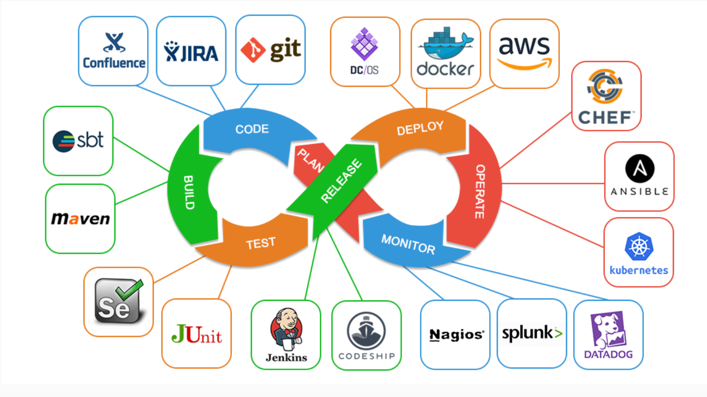

# DevOps 101

## What is DevOps

DevOps is the acronym given to the combination of Development and Operations. It refers to a collaborative approach to make the Application Development team and the IT Operations team of an organization to seamlessly work with better communication.

> **Note**
>
> “DevOps is the union of people, process, and products to enable continuous delivery of value to our end users.”
>
## Why is Devops

### 1. Business Challenges

In modern world competition is so fierce, winner decided by who can innovate faster and deliver it to the end user, with DevOps, our product that being develop can be ship faster and with better quality trough automation and we receive feedback and able to plan ahead to innovate further.

### 2. Internal IT Challenges

In the old ways Development team and Operation team have completely different mindset. the one wanting to innovate faster and deliver it to client, in the other hand Operation team want stability (fewer bug and downtime), With DevOps practice this two polar opposite teams can work side by side, trough automation to ensure quality of our product, and minimize repeatable work that prone to error.this makes both teams can innovate faster and ensure stability.

## DevOps Toys

On this coaction we will play with

* [Git](../docs/02-git.md)
* [Container (Docker)](../docs/03-container-intro.md)
* [CI/CD tools (Jenkins)](../docs/06-%20jenkins.md)