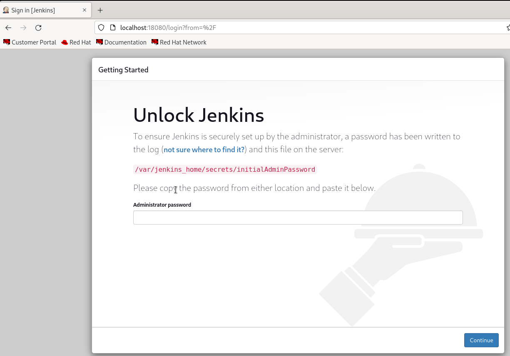
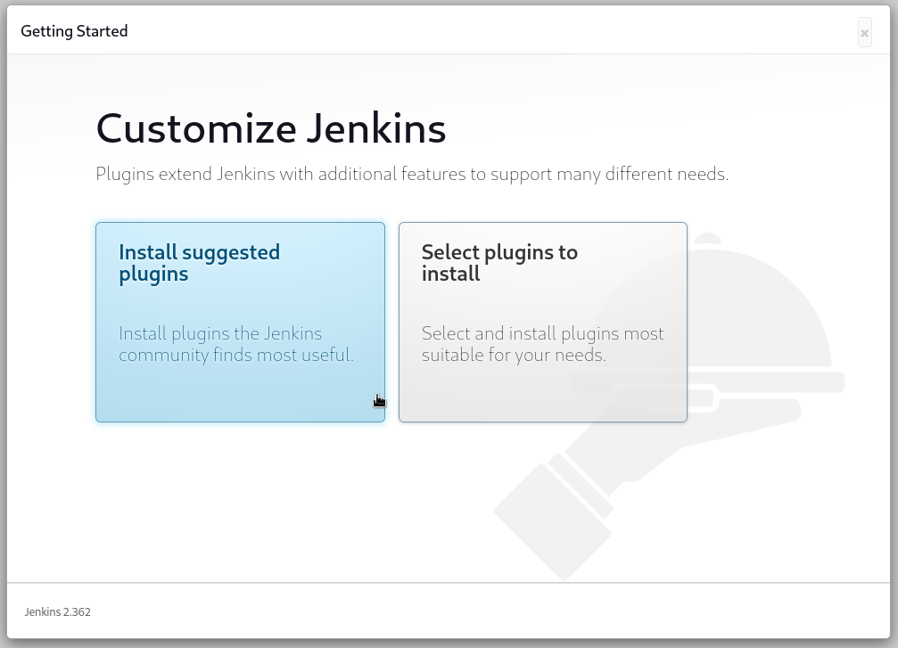
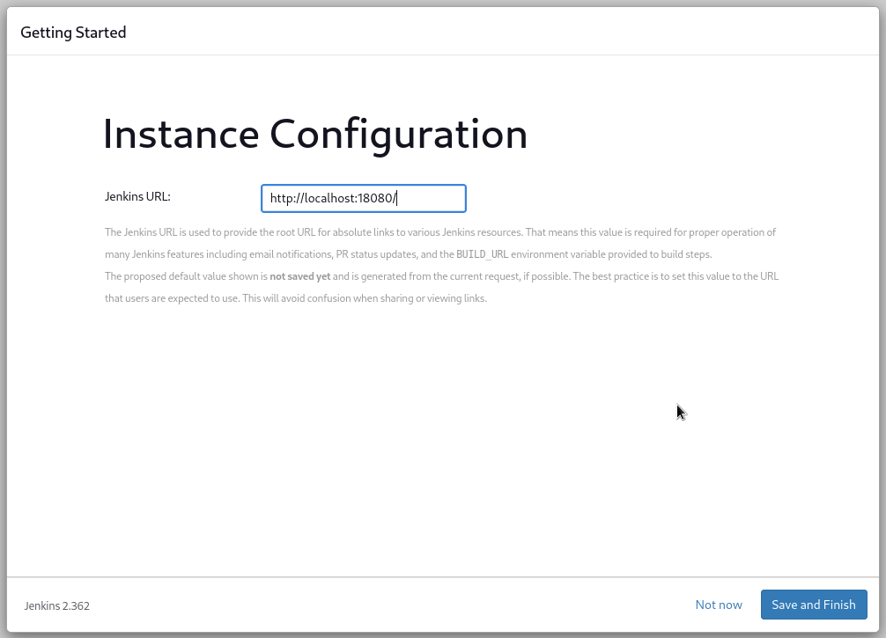
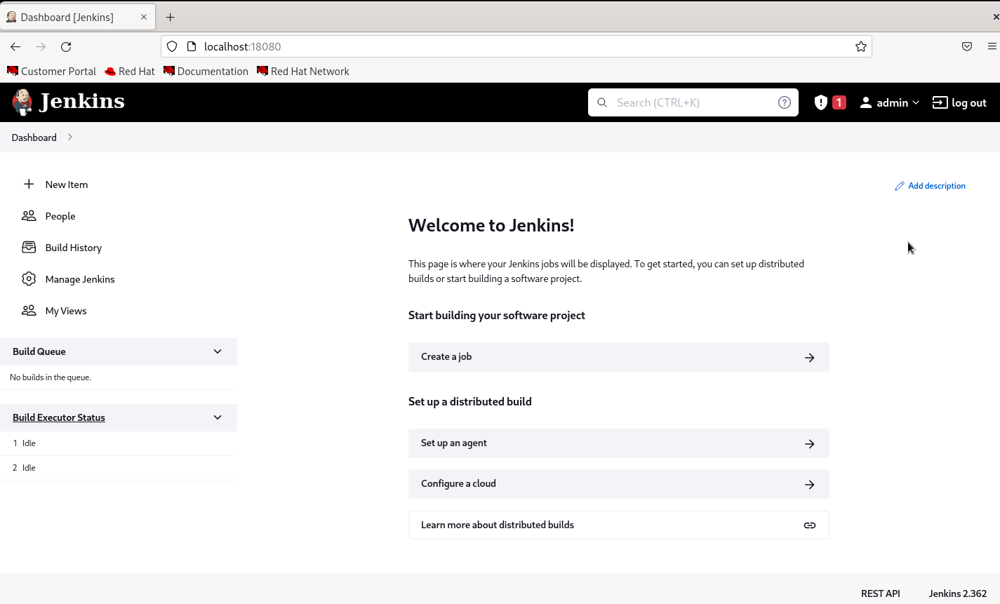

# Jenkins Installation using .war file

## 1. Download jenkins.war file

```bash
wget https://mirrors.tuna.tsinghua.edu.cn/jenkins/war-stable/2.346.3/jenkins.war
```

## 2. Download Open JDK 11 (if not already exists)

```bash
yum install java-11-openjdk
java -version
```


## 3. Run Jenkins

Run the jenkins with jenkins.war file. Thecommand is down below:

```bash
java -jar <path_where_the_file_is> -httpPort=<port-for-jenkins>

example:
java -jar /opt/jenkins.war -httpPort=18080
```

## 4. Access Jenkins with localhost:(ex: localhost:18080)



Get admin password in `/var/jenkins_home/secrets/initialAdminPassword` or you can view your jenkins logs.

```bash
# view initialAdminPassword file
cat /var/jenkins_home/secrets/initialAdminPassword
```

## 5. Install recommended plugin




## 6. Create Admin User


## 7. Setting Jenkins Url(default=localhost:port)



## 8. Installation Complete



